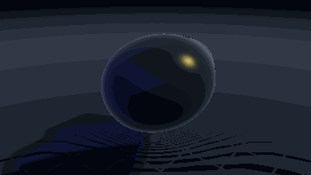
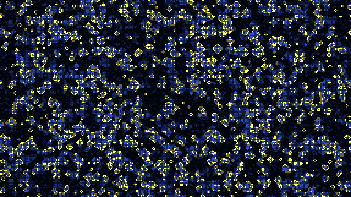

# Miri: GPU-first programming language

<p align="center">
  
</p>

**Miri is a statically typed, natively compiled programming language with first-class GPU programming: mark data `gpu`, launch with `forall`, no CUDA toolchain.**

Miri is built for **agentic engineering** — a world in which the majority of production code is generated, repaired, and shipped by autonomous agents. Humans declare intent. The compiler enforces the invariants agents are most likely to violate, and the toolchain emits structured artifacts agents can consume directly.

## GPU, from the language up

Every animation below is a real Miri program — plain `forall` loops over `gpu`-resident buffers, compiled to WGSL and run on the GPU. No host/device boilerplate.

<p align="center">
  <a href="https://miri-lang.org/gpu-demos/"></a>
  <a href="https://miri-lang.org/gpu-demos/"></a>
  <a href="https://miri-lang.org/gpu-demos/"></a>
  <a href="https://miri-lang.org/gpu-demos/"></a>
</p>

<p align="center"><b><a href="https://miri-lang.org/gpu-demos/">▶ Run all eight demos live in your browser →</a></b></p>

```miri
gpu let a = [1.0, 2.0, 3.0, 4.0]
gpu let b = [5.0, 6.0, 7.0, 8.0]
gpu var dst = [0.0, 0.0, 0.0, 0.0]

forall i in 0..a.length()
    dst[i] = a[i] + b[i]

let host = dst // the only boundary crossing: assignment = readback
println(f"{host[0]} {host[1]} {host[2]} {host[3]}") // 6.0 8.0 10.0 12.0
```

## Current State (v0.6.0-beta.4)

This release is the **Extended Standard Library**. Miri now ships a standard library broad enough for practical programs — file I/O, platform access, time, regex, JSON, extra collections — plus a native test runner and a pair of memory-diagnostic tools that keep the whole suite provably leak- and corruption-free.

**New in v0.6.0-beta.4:**
- **`system.fs`, `system.os`, `system.time`** — capability-class access to the outside world: an `Fs` handle for files and directories, `Env`/`Args` for the environment and argv, `platform()`, `exit()`, and `Clock`/`Instant`/`Duration` for time. A function without the capability parameter cannot touch that part of the world.
- **`system.text` regex** — `Regex.compile(...)` returning `Result`, plus compile-time-validated regex literals (`re"^\d+$"i`); `String` gains `split`, `join`, `to_int`, `to_float`. Match arms now support string, float, and regex predicates.
- **`system.json`** — a recursive `Json` enum with a pure-Miri parser, position-carrying parse errors, serialization, and `T?` accessors. No compiler special-casing.
- **`system.collections`** — `Queue<T>` and `Stack<T>` by composition, with the full derived `Iterable`/`Queryable`/`Foldable` surface for free.
- **Attributes + `miri test`** — a closed attribute registry (`@non_exhaustive`, `@must_use`, `@test`, `@ignore(reason)`, `@xfail(reason)`; unknown attributes are compile errors, never no-ops) and a native test runner: `miri test` discovers `@test` functions, runs each in an isolated subprocess, and reports cargo-style — with `@xfail` pinning known bugs without greenwashing.
- **Assertions & formatting for real types** — f-strings render `Option`, `Result`, and any user enum (`f"{Some(15)}"` → `Some(15)`); `assert_eq`/`assert_ne` compare and diff enums, `Option`/`Result`, structs, and classes defining `equals` (`expected Point(x=3, y=4), got Point(x=1, y=2)`). Structural `==` was fixed along the way: enum payloads and managed fields now compare by value, not pointer.
- **Memory diagnostics** — `MIRI_HEAP_GUARD=1` (ASan-style shadow heap catching use-after-free, double-free, and attributed leaks; the full suite runs green under it nightly), a path-sensitive reference-count verifier running as a hard error on every PR, and `MIRI_ALLOC_COUNT=1` for exact allocation counts. Burning the guard's findings down to zero fixed dozens of real reference-counting defects.
- **No panics, no sentinels** — nothing in the stdlib panics; `index_of` returns `int?` instead of `-1`, `pop`/`remove_at` return `T?` instead of trapping. Static class members (`Duration.from_millis(500)`) shipped as the language feature this required.

Building on prior betas: the GPU preview (WGSL backend, `gpu` residency, `forall`, kernels, vectors, eight browser demos), full Perceus memory safety, `Result<T, E>` with enforced `must_use`, a backend-agnostic `system.math`, the four-trait collection pipeline, and `system.testing`.

**Why WGSL first — and what's next.** WGSL/WebGPU is the *first* GPU backend, not the only planned one. It shipped first because it's portable and runs everywhere — including the browser, so the demos above need zero install — and it let us prove the whole language→GPU path (residency, `forall`, kernels, codegen, host runtime) end-to-end against a single target before multiplying backends. The GPU representation in MIR is being made backend-neutral so additional backends — a native SPIR-V / Vulkan path and others — can plug in behind the exact same `forall` / `gpu fn` surface, with no changes to your source.

## Language at a glance

```miri
use system.io

struct Point
    x int
    y int

fn main()
    let p = Point(x: 1, y: 2)
    println(f"{p.x}, {p.y}")
```

Value semantics are enforced — assignment is a logical copy, mutation never aliases, and memory is managed with zero annotations (only `out` for in-place mutation):

```miri
use system.collections.list

fn main()
    let a = List([1, 2, 3])
    var b = a            // copy-on-write share
    b.push(4)            // CoW fires: b becomes independent
    println(f"{a.length()} {b.length()}")   // 3 4
```

Resource types (those defining `fn drop(self)`) are tracked strictly — using one after it is consumed is a compile error, with a multi-hop diagnostic explaining *why*:

```miri
fn main()
    let f = File(handle: 1)
    archive(f)
    archive(f)           // compile error: 'f' was consumed by 'archive'
```

Miri also ships classes with inheritance and virtual dispatch, traits with default methods, closures, generics with monomorphization, pattern matching, `Option`/`Result`, tuples, enums with data, and a multi-file module system with cross-module visibility.

**→ Full language tour, GPU guide, and API docs at [miri-lang.org](https://miri-lang.org).**

## Architecture

Miri follows a standard compiler pipeline:

```text
Source(s) → Lexer → Parser → AST → Type Checker → MIR → Codegen → Executable
                                                    │
                                                    ├─ Cranelift  → native binary
                                                    └─ WGSL       → WebGPU
```

The `Pipeline` struct in `src/pipeline.rs` orchestrates discovery, frontend (lex/parse), analysis (type checking + cross-module visibility), MIR lowering with optimization passes (including the Perceus reference-counting transform), and backend codegen. On the CPU side, Cranelift is the default backend and an LLVM backend is planned for optimized production builds. On the GPU side, WGSL is the current backend; the MIR GPU representation is being made backend-neutral so native paths (SPIR-V / Vulkan and beyond) can be added behind the same surface.

## Repository Layout

```bash
src/
├── ast/          # Syntax tree definitions
├── cli/          # Command-line interface
├── codegen/      # Backend implementations (Cranelift, WGSL)
├── error/        # Error types and formatting
├── lexer/        # Source tokenization
├── mir/          # IR definitions, lowering, and optimization passes
├── parser/       # Parsing logic
├── runtime/      # Runtime intrinsics (core + GPU) — separate staticlib crates
├── stdlib/       # Standard Library (system.*), written in Miri
├── type_checker/ # Type inference, validation, residency analysis
└── pipeline.rs   # Main compiler driver
```

## Building & Testing

Miri is written in Rust. Build with a stable Rust toolchain:

```bash
make build        # Build compiler + all runtime crates (debug)
make release      # Build compiler + all runtime crates (release) → target/release/miri
make test         # Run the full suite (compiler, stdlib, runtimes)
make lint         # Check formatting + clippy
make format       # Auto-format all code
```

## Contributing

We welcome contributions! Please read our [Contributing Guide](CONTRIBUTING.md) for details on code style, testing requirements, and the submission process.

### Contributors

- Viacheslav Shynkarenko aka Slavik Shynkarenko (maintainer)

## License

[Apache-2.0](LICENSE)
